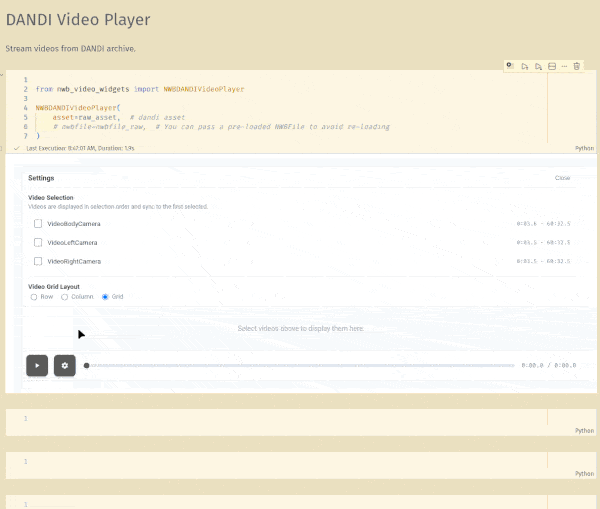

# nwb-video-widgets

[](https://badge.fury.io/py/nwb-video-widgets)
[](https://www.python.org/downloads/)
[](https://opensource.org/licenses/MIT)

Interactive Jupyter widgets for NWB video and pose estimation visualization. Built with [anywidget](https://anywidget.dev/) for compatibility across JupyterLab, Jupyter Notebook, VS Code, and Google Colab.

## Table of Contents

- [Installation](#installation)
- [Video Player Widgets](#video-player-widgets)
- [Pose Estimation Widgets](#pose-estimation-widgets)
## Installation

For local only NWB file usage:

```bash
pip install nwb-video-widgets
```

For DANDI integration and streaming support:

```bash
pip install nwb-video-widgets[dandi]
```

## Video Player Widgets

Multi-camera synchronized video player with configurable layout (Row, Column, or Grid).



**Features:**

- Interactive settings panel for video selection
- Multiple layout modes (Row, Column, Grid)
- Synchronized playback across all videos
- Session time display with NWB timestamps

### DANDI Streaming

Use `NWBDANDIVideoPlayer` for videos hosted on DANDI:

```python
from dandi.dandiapi import DandiAPIClient
from nwb_video_widgets import NWBDANDIVideoPlayer

client = DandiAPIClient()
dandiset = client.get_dandiset("000409", "draft")
asset = dandiset.get_asset_by_path("sub-NYU-39/sub-NYU-39_ses-..._behavior.nwb")

widget = NWBDANDIVideoPlayer(asset=asset)
widget
```

### Local Files

Use `NWBLocalVideoPlayer` for local NWB files:

```python
from pynwb import read_nwb
from nwb_video_widgets import NWBLocalVideoPlayer

nwbfile = read_nwb("experiment.nwb")
widget = NWBLocalVideoPlayer(nwbfile)
widget
```

### Fixed Grid Layout

When you know exactly which videos you want to display and how to arrange them, use the `video_grid` parameter to bypass the interactive settings panel. This is useful for:

- Reproducible notebooks where you want consistent output
- Presentations or demos with predetermined layouts
- Embedding widgets in dashboards or reports

The `video_grid` parameter accepts a 2D list where each inner list represents a row of videos:

```python
# Single row of three cameras
widget = NWBLocalVideoPlayer(
    nwbfile,
    video_grid=[["VideoLeftCamera", "VideoBodyCamera", "VideoRightCamera"]]
)

# 2x2 grid layout
widget = NWBLocalVideoPlayer(
    nwbfile,
    video_grid=[
        ["VideoLeftCamera", "VideoRightCamera"],
        ["VideoBodyCamera", "VideoTopCamera"],
    ]
)

# Asymmetric grid (2 videos on top, 1 on bottom)
widget = NWBLocalVideoPlayer(
    nwbfile,
    video_grid=[
        ["VideoLeftCamera", "VideoRightCamera"],
        ["VideoBodyCamera"],
    ]
)
```

The same parameter works with `NWBDANDIVideoPlayer`:

```python
widget = NWBDANDIVideoPlayer(
    asset=asset,
    video_grid=[["VideoLeftCamera", "VideoRightCamera"]]
)
```

Video names that don't exist in the NWB file are silently skipped.

### Custom Video Labels

By default, the video name from the NWB file is displayed under each video. Use the `video_labels` parameter to provide custom display names:

```python
widget = NWBLocalVideoPlayer(
    nwbfile,
    video_grid=[["VideoLeftCamera", "VideoRightCamera"]],
    video_labels={
        "VideoLeftCamera": "Left",
        "VideoRightCamera": "Right",
    }
)
```

Videos not in the dictionary will display their original name.

---

## Pose Estimation Widgets

Overlays DeepLabCut keypoints on streaming video with support for camera selection.


**Features:**

- Camera selection via settings panel
- Keypoint visibility toggles (All/None/individual)
- Label display toggle
- Session time display (NWB timestamps)
- Custom keypoint colors via colormap or explicit hex values
- Supports split files (videos in raw file, pose in processed file)

### DANDI Streaming

Use `NWBDANDIPoseEstimationWidget` for DANDI-hosted files:

```python
from dandi.dandiapi import DandiAPIClient
from nwb_video_widgets import NWBDANDIPoseEstimationWidget

client = DandiAPIClient()
dandiset = client.get_dandiset("000409", "draft")

# Single file (videos + pose in same file)
asset = dandiset.get_asset_by_path("sub-.../sub-..._combined.nwb")
widget = NWBDANDIPoseEstimationWidget(asset=asset)

# Or split files (videos in raw, pose in processed)
raw_asset = dandiset.get_asset_by_path("sub-.../sub-..._desc-raw.nwb")
processed_asset = dandiset.get_asset_by_path("sub-.../sub-..._desc-processed.nwb")
widget = NWBDANDIPoseEstimationWidget(
    asset=processed_asset,
    video_asset=raw_asset,
)
widget
```

### Local Files

Use `NWBLocalPoseEstimationWidget` for local NWB files:

```python
from pynwb import read_nwb
from nwb_video_widgets import NWBLocalPoseEstimationWidget

# Single file
nwbfile = read_nwb("experiment.nwb")
widget = NWBLocalPoseEstimationWidget(nwbfile)
widget

# Or split files
nwbfile_raw = read_nwb("raw.nwb")
nwbfile_processed = read_nwb("processed.nwb")
widget = NWBLocalPoseEstimationWidget(
    nwbfile=nwbfile_processed,
    video_nwbfile=nwbfile_raw,
)
widget
```

**Parameters:**

| Parameter | Type | Description |
|-----------|------|-------------|
| `keypoint_colors` | `str` or `dict` | Matplotlib colormap name (e.g., `'tab10'`) or dict mapping keypoint names to hex colors |
| `default_camera` | `str` | Camera to display initially |

